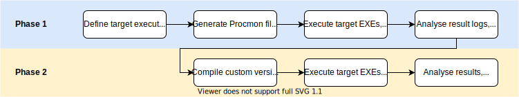

# Windows DLL Hijacking

## Background
This repo contains all scripts used to find _relative path DLL Hijacking_ candidates on Windows 10 (version 1909), as described in **[this blog post](https://wietze.github.io/blog/hijacking-dlls-in-windows)**. 

## Approach
The approach taken consists of two phases: 
1. The first phase is about identifying which DLLs _may_ be vulnerable to hijacking; 
2. The second phase is about confirming which ones actually do.

Each phase is explained in more detail in the README files of their associated subfolders in this repo. 

_Used approach,taken from the [blog post]((https://wietze.github.io/blog/hijacking-dlls-in-windows))_.

## Contents
| Item | Description |
| ---- | ----------- |
| [`1_finding_candidates/`](/1_finding_candidates/) | Files for Phase 1, which will result in a CSV file with all possible DLL hijack candidates. |
| [`2_compiling_dlls/`](/2_compiling_dlls/) | Files for Phase 2, which will result in a set of files identifying confirmed DLL hijack candidates. |
| [`dll_hijacking_candidates.csv`](/dll_hijacking_candidates.csv) | A CSV file with all identified _relative path DLL Hijacking_ candidates on Windows 10 (version 1909). |
| [`possible_windows_dll_hijacking.yml`](/possible_windows_dll_hijacking.yml) | Sigma rule identifying DLL loads of files in the list of DLL Hijack candidates from a folder other than their expected locations. |
| `REAMDE.md` | This file. |
